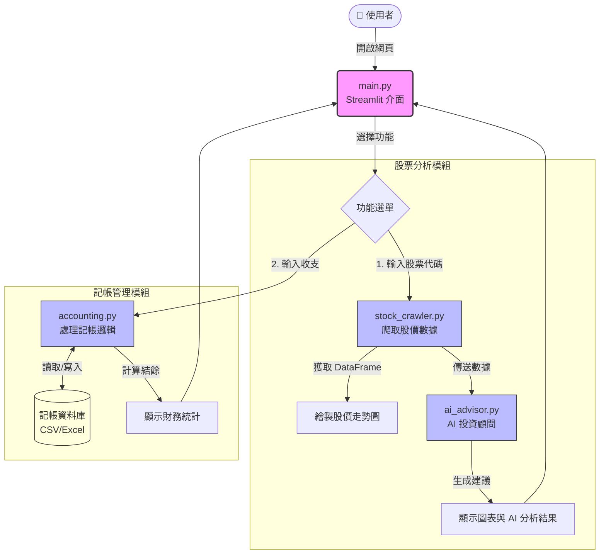

```mermaid
graph TD
    %% 定義節點樣式
    classDef main fill:#f9f,stroke:#333,stroke-width:2px;
    classDef sub fill:#bbf,stroke:#333,stroke-width:1px;
    classDef db fill:#ffd,stroke:#333,stroke-width:1px;

    User([👤 使用者]) -->|開啟網頁| Main(main.py <br/> Streamlit 介面):::main

    Main -->|選擇功能| Router{功能選單}

    %% 股票分析區塊
    subgraph Stock_System [股票分析模組]
        Router -->|1. 輸入股票代碼| Crawler[stock_crawler.py <br/> 爬取股價數據]:::sub
        Crawler -->|獲取 DataFrame| Plotly[繪製股價走勢圖]
        Crawler -->|傳送數據| AI[ai_advisor.py <br/> AI 投資顧問]:::sub
        AI -->|生成建議| Result[顯示圖表與 AI 分析結果]
    end

    %% 記帳區塊
    subgraph Accounting_System [記帳管理模組]
        Router -->|2. 輸入收支| Acc[accounting.py <br/> 處理記帳邏輯]:::sub
        Acc <-->|讀取/寫入| CSV[(記帳資料庫 <br/> CSV/Excel)]:::db
        Acc -->|計算結餘| Stats[顯示財務統計]
    end

    %% 連結
    Result --> Main
    Stats --> Main
```
